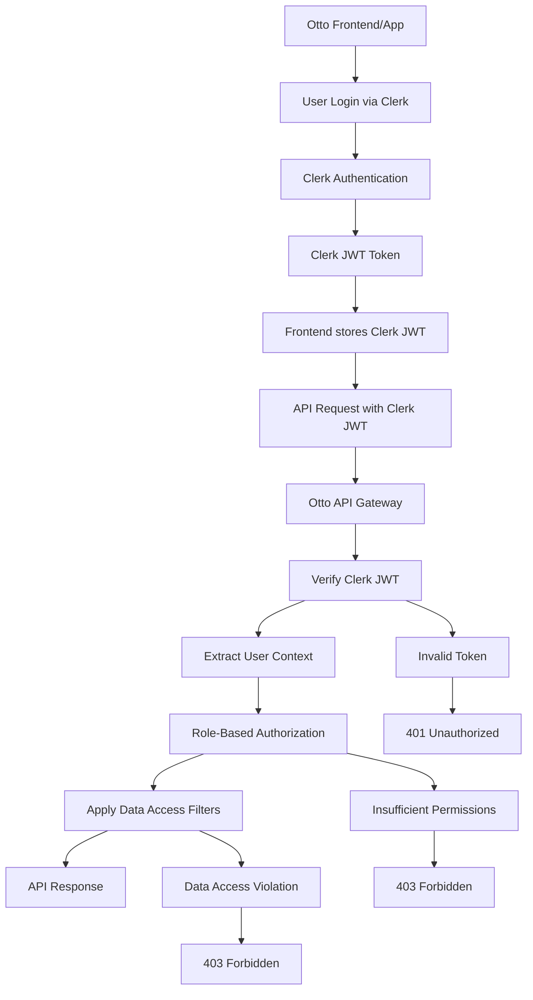

# Otto AI Comprehensive Authentication Documentation

## Overview

The Otto AI platform implements a comprehensive authentication system with **4 distinct user roles**, **Clerk integration**, and **role-based data access control**. This system ensures secure, scalable access control while providing role-appropriate data access for the RAG/Ask Otto system.

## Authentication Architecture

### **Authentication Flow**



## User Roles & Business Functions

### **1. 👑 Admin (Full System Access)**
```yaml
role: admin
permissions: ["*"]  # All permissions
business_functions:
  - System administration
  - User management
  - Company settings
  - Full analytics access
  - SOP configuration
  - Document management
  - Team oversight
  - System monitoring
```

### **2. 📊 Manager (Team Management + Analytics)**
```yaml
role: manager
permissions:
  - calls:read, calls:write
  - analytics:read, analytics:write
  - sop:read, sop:write
  - clone:read, clone:write
  - summary:read, summary:write
  - followup:read, followup:write
  - rag:read, rag:write
  - documents:read, documents:write
business_functions:
  - Team performance oversight
  - Analytics and reporting
  - SOP management
  - Coaching and training
  - Lead quality analysis
  - Team analytics
```

### **3. 📞 CSR - Customer Support Rep (Lead Qualification)**
```yaml
role: csr
permissions:
  - calls:read, calls:write
  - clone:read, clone:write
  - summary:read, summary:write
  - followup:read, followup:write
  - analytics:read_own
business_functions:
  - Incoming call handling
  - Lead qualification
  - Follow-up management
  - Personal AI clone usage
  - Basic performance tracking
  - Lead scoring and classification
```

### **4. 💼 Sales Rep (Outbound Sales)**
```yaml
role: sales_rep
permissions:
  - calls:read, calls:write
  - clone:read, clone:write
  - summary:read, summary:write
  - followup:read, followup:write
  - analytics:read_own
business_functions:
  - Outbound sales calls
  - Appointment setting
  - Follow-up management
  - Personal AI clone usage
  - Performance tracking
  - Rehash scoring and prioritization
```

## API Endpoint Access Control

### **Role-Based API Access Matrix**

| **API Category** | **Admin** | **Manager** | **CSR** | **Sales Rep** |
|------------------|-----------|-------------|---------|---------------|
| **System APIs** | ✅ | ✅ | ✅ | ✅ |
| **Call Data Ingestion** | ✅ | ✅ | ✅ | ✅ |
| **Document Ingestion** | ✅ | ✅ | ❌ | ❌ |
| **Voice Intelligence** | ✅ | ✅ | ✅ | ✅ |
| **RAG/Ask Otto** | ✅ | ✅ | ✅ | ✅ |
| **Personal AI** | ✅ | ✅ | ✅ | ✅ |
| **Follow-up APIs** | ✅ | ✅ | ✅ | ✅ |
| **SOP Management** | ✅ | ✅ | ❌ | ❌ |
| **Analytics** | ✅ | ✅ | 🔒 Limited | 🔒 Limited |
| **Webhooks** | ✅ | ✅ | ✅ | ✅ |

### **Detailed Endpoint Permissions**

#### **🔐 Admin & Manager Only**
```yaml
restricted_endpoints:
  document_ingestion:
    - POST /api/v1/ingestion/sop-documents
    - POST /api/v1/ingestion/training-documents
    - POST /api/v1/ingestion/reference-documents
    - POST /api/v1/ingestion/documents/upload
    - POST /api/v1/ingestion/documents/complete
  
  rag_ask_otto:
    - WS /api/v1/rag/query
    - GET /api/v1/rag/queries
  
  sop_management:
    - POST /api/v1/sop/stages
    - GET /api/v1/sop/stages
    - PUT /api/v1/sop/stages/{stage_id}
    - DELETE /api/v1/sop/stages/{stage_id}
    - GET /api/v1/sop/compliance/{company_id}
    - POST /api/v1/sop/compliance/analyze
  
  analytics:
    - GET /api/v1/analytics/performance/{company_id}
    - GET /api/v1/analytics/reps/{company_id}
    - GET /api/v1/analytics/objections/{company_id}
    - GET /api/v1/analytics/leads/{company_id}
```

#### **✅ All Roles Access**
```yaml
open_endpoints:
  call_data_ingestion:
    - POST /api/v1/calls
    - GET /api/v1/calls/{call_id}
    - PUT /api/v1/calls/{call_id}
    - GET /api/v1/calls/{call_id}/status
    - GET /api/v1/calls/{call_id}/audio
    - GET /api/v1/calls/{call_id}/transcript
    - GET /api/v1/calls/{call_id}/diarization
  
  voice_intelligence:
    - POST /api/v1/asr/transcribe
    - GET /api/v1/calls/{call_id}/speakers
    - GET /api/v1/calls/{call_id}/lead-classification
    - GET /api/v1/calls/{call_id}/objections
    - GET /api/v1/calls/{call_id}/sop-analysis
    - GET /api/v1/calls/{call_id}/coaching
    - GET /api/v1/calls/{call_id}/meeting-segments
    - GET /api/v1/calls/{call_id}/rehash-score
  
  personal_ai:
    - GET /api/v1/clone/{rep_id}/profile
    - POST /api/v1/clone/{rep_id}/generate
    - GET /api/v1/clone/{rep_id}/drafts
    - POST /api/v1/clone/{rep_id}/train
    - GET /api/v1/clone/{rep_id}/status
  
  follow_up:
    - POST /api/v1/ai/followup/draft
    - POST /api/v1/ai/followup/nurture
    - POST /api/v1/ai/followup/rehash
    - GET /api/v1/calls/{call_id}/follow-up-tasks
    - POST /api/v1/calls/{call_id}/follow-up-tasks
    - GET /api/v1/followup/{rep_id}/drafts
  
  summarization:
    - POST /api/v1/summary/daily
    - POST /api/v1/summary/appointment
    - POST /api/v1/summary/prep
    - GET /api/v1/summary/{rep_id}/history
    - GET /api/v1/summary/call/{call_id}
```

## RAG/Ask Otto Role-Based Data Access

### **Data Access Matrix by Role**

| **Role** | **Data Access** | **Business Context** |
|----------|-----------------|---------------------|
| **Admin** | 🏢 **Full Company Data** | System-wide insights, all teams, all calls |
| **Manager** | 🏢 **Full Company Data** | Team oversight, performance analytics, coaching |
| **CSR** | 📞 **Own Calls + Company Knowledge** | Personal performance + company SOPs/training |
| **Sales Rep** | 💼 **Own Calls + Company Knowledge** | Personal performance + company SOPs/training |

### **RAG Data Sources by Role**

#### **🔐 Admin & Manager (Company-Wide Data Access)**
```yaml
data_sources:
  - all_call_transcripts
  - all_call_analytics
  - all_rep_performance
  - company_sops
  - training_materials
  - reference_documents
  - analytics_data
  - objection_patterns
  - lead_quality_metrics
  - team_performance_trends

example_queries:
  - "What are the top objections across all teams this month?"
  - "Which CSR has the highest conversion rate?"
  - "Show me the SOP compliance for all reps"
  - "What are the common follow-up patterns that work best?"
  - "Which sales rep needs the most coaching?"
  - "How is the team performing overall?"
  - "What are the company-wide trends in lead quality?"
```

#### **📞 CSR (Individual Data + Company Knowledge)**
```yaml
data_sources:
  - own_call_transcripts
  - own_performance_metrics
  - company_sops
  - training_materials
  - reference_documents
  - own_follow_up_tasks
  - own_lead_classifications

example_queries:
  - "What objections did I handle today?"
  - "How can I improve my lead qualification?"
  - "What's the best response to price objections?"
  - "Show me my follow-up tasks for this week"
  - "How does my performance compare to company averages?"
  - "What SOPs should I follow for lead qualification?"
  - "Show me my personal performance trends"
```

#### **💼 Sales Rep (Individual Data + Company Knowledge)**
```yaml
data_sources:
  - own_call_transcripts
  - own_performance_metrics
  - company_sops
  - training_materials
  - reference_documents
  - own_follow_up_tasks
  - own_appointment_summaries

example_queries:
  - "What appointments did I have this week?"
  - "How can I improve my rehash score?"
  - "What's the best approach for cold calling?"
  - "Show me my personal AI clone performance"
  - "What follow-up strategies work best for my leads?"
  - "What SOPs should I follow for appointment setting?"
  - "Show me my personal performance trends"
```

## Implementation Architecture

### **1. Authentication Service**

```python
# services/auth_service.py
from clerk_sdk import ClerkClient
from typing import Optional
from dataclasses import dataclass

@dataclass
class UserContext:
    user_id: str
    company_id: str
    role: str
    permissions: list[str]
    is_active: bool

class ClerkAuthService:
    def __init__(self, clerk_secret_key: str):
        self.clerk_client = ClerkClient(clerk_secret_key)
    
    async def verify_token(self, token: str) -> UserContext:
        """Verify Clerk JWT and extract user context"""
        try:
            # Verify token with Clerk
            payload = self.clerk_client.verify_token(token)
            
            # Extract user information
            user_id = payload['sub']
            company_id = payload.get('company_id')
            role = payload.get('role', 'sales_rep')
            
            # Get permissions based on role
            permissions = self._get_role_permissions(role)
            
            return UserContext(
                user_id=user_id,
                company_id=company_id,
                role=role,
                permissions=permissions,
                is_active=payload.get('is_active', True)
            )
        except Exception as e:
            raise AuthenticationError(f"Invalid token: {str(e)}")
    
    def _get_role_permissions(self, role: str) -> list[str]:
        """Get permissions based on user role"""
        ROLE_PERMISSIONS = {
            'admin': ['*'],
            'manager': [
                'calls:read', 'calls:write',
                'analytics:read', 'analytics:write',
                'sop:read', 'sop:write',
                'clone:read', 'clone:write',
                'summary:read', 'summary:write',
                'followup:read', 'followup:write',
                'rag:read', 'rag:write',
                'documents:read', 'documents:write'
            ],
            'csr': [
                'calls:read', 'calls:write',
                'clone:read', 'clone:write',
                'summary:read', 'summary:write',
                'followup:read', 'followup:write',
                'analytics:read_own',
                'rag:read'
            ],
            'sales_rep': [
                'calls:read', 'calls:write',
                'clone:read', 'clone:write',
                'summary:read', 'summary:write',
                'followup:read', 'followup:write',
                'analytics:read_own',
                'rag:read'
            ]
        }
        return ROLE_PERMISSIONS.get(role, [])
```

### **2. Role-Based Authorization Middleware**

```python
# middleware/authorization.py
from fastapi import Request, HTTPException
from typing import Optional

class RoleAuthorization:
    def __init__(self, required_permission: Optional[str] = None, 
                 required_role: Optional[str] = None):
        self.required_permission = required_permission
        self.required_role = required_role
    
    async def __call__(self, request: Request, call_next):
        user_context = request.state.user
        
        # Check role-based access
        if self.required_role:
            if not self._check_role_access(user_context.role, self.required_role):
                raise HTTPException(
                    status_code=403, 
                    detail="Insufficient role permissions"
                )
        
        # Check specific permission
        if self.required_permission:
            if not self._check_permission(user_context, self.required_permission):
                raise HTTPException(
                    status_code=403, 
                    detail="Insufficient permissions"
                )
        
        return await call_next(request)
    
    def _check_role_access(self, user_role: str, required_role: str) -> bool:
        """Check if user role has access to required role"""
        # Admin has access to all roles
        if user_role == 'admin':
            return True
        
        # Manager has access to manager-level endpoints
        if user_role == 'manager' and required_role == 'manager':
            return True
        
        # CSR and Sales Rep have access to their own endpoints
        if user_role in ['csr', 'sales_rep'] and required_role in ['csr', 'sales_rep']:
            return True
        
        return False
    
    def _check_permission(self, user_context: UserContext, permission: str) -> bool:
        """Check if user has specific permission"""
        if '*' in user_context.permissions:
            return True
        
        return permission in user_context.permissions
```

### **3. RAG Context Builder**

```python
# services/rag_context_builder.py
from dataclasses import dataclass
from typing import List, Dict, Any

@dataclass
class RAGContext:
    company_id: str
    user_id: str
    role: str
    data_sources: List[str]
    filters: Dict[str, Any]
    permissions: List[str]

class RAGContextBuilder:
    def __init__(self, user_context: UserContext):
        self.user_context = user_context
        self.company_id = user_context.company_id
        self.user_id = user_context.user_id
        self.role = user_context.role
    
    def build_query_context(self, query: str) -> RAGContext:
        """Build role-specific context for RAG queries"""
        
        if self.role in ['admin', 'manager']:
            return self._build_company_wide_context(query)
        elif self.role in ['csr', 'sales_rep']:
            return self._build_individual_context(query)
        else:
            raise PermissionError("Invalid role for RAG access")
    
    def _build_company_wide_context(self, query: str) -> RAGContext:
        """Build context for admin/manager with full company access"""
        return RAGContext(
            company_id=self.company_id,
            user_id=self.user_id,
            role=self.role,
            data_sources=[
                "all_call_transcripts",
                "all_analytics",
                "company_sops",
                "training_materials",
                "reference_documents"
            ],
            filters={
                "company_id": self.company_id,
                "date_range": "last_30_days"
            },
            permissions=["read_all", "analytics_all"]
        )
    
    def _build_individual_context(self, query: str) -> RAGContext:
        """Build context for CSR/Sales Rep with individual data access"""
        return RAGContext(
            company_id=self.company_id,
            user_id=self.user_id,
            role=self.role,
            data_sources=[
                "own_call_transcripts",
                "own_performance",
                "company_sops",
                "training_materials",
                "reference_documents"
            ],
            filters={
                "company_id": self.company_id,
                "user_id": self.user_id,
                "date_range": "last_30_days"
            },
            permissions=["read_own", "analytics_own", "rag:read"]
        )
```

### **4. RAG Security Middleware**

```python
# middleware/rag_security.py
class RAGSecurityMiddleware:
    def __init__(self):
        self.restricted_keywords = {
            'csr': [
                'team performance', 'other reps', 'company analytics',
                'all teams', 'team members', 'company-wide'
            ],
            'sales_rep': [
                'team performance', 'other reps', 'company analytics',
                'all teams', 'team members', 'company-wide'
            ]
        }
    
    async def validate_data_access(self, user_context: UserContext, query: str):
        """Validate user has access to requested data"""
        
        # Check if query requests restricted data
        if self._requests_restricted_data(query, user_context.role):
            raise PermissionError("Insufficient permissions for requested data")
        
        # Apply role-based data filtering
        return await self._apply_role_filters(user_context)
    
    def _requests_restricted_data(self, query: str, role: str) -> bool:
        """Check if query requests data beyond user's role"""
        
        if role in self.restricted_keywords:
            for keyword in self.restricted_keywords[role]:
                if keyword.lower() in query.lower():
                    return True
        
        return False
    
    async def _apply_role_filters(self, user_context: UserContext):
        """Apply role-based data filters"""
        if user_context.role in ['csr', 'sales_rep']:
            return {
                'user_id': user_context.user_id,
                'company_id': user_context.company_id,
                'exclude_team_data': True
            }
        else:
            return {
                'company_id': user_context.company_id,
                'include_team_data': True
            }
```

## Security Implementation

### **1. Token Security**

```python
# core/security.py
import jwt
from datetime import datetime, timedelta
from typing import Optional

class TokenSecurity:
    def __init__(self, clerk_secret_key: str):
        self.clerk_secret_key = clerk_secret_key
    
    async def verify_clerk_token(self, token: str) -> dict:
        """Verify Clerk JWT token"""
        try:
            # Verify token with Clerk
            payload = jwt.decode(
                token, 
                self.clerk_secret_key, 
                algorithms=['HS256']
            )
            
            # Check token expiration
            if datetime.utcnow() > datetime.fromtimestamp(payload['exp']):
                raise TokenExpiredError("Token has expired")
            
            return payload
        except jwt.InvalidTokenError:
            raise AuthenticationError("Invalid token")
    
    def extract_user_context(self, payload: dict) -> UserContext:
        """Extract user context from token payload"""
        return UserContext(
            user_id=payload['sub'],
            company_id=payload.get('company_id'),
            role=payload.get('role', 'sales_rep'),
            permissions=self._get_permissions(payload.get('role')),
            is_active=payload.get('is_active', True)
        )
```

### **2. Request Authentication Middleware**

```python
# middleware/auth_middleware.py
from fastapi import Request, HTTPException
from fastapi.security import HTTPBearer, HTTPAuthorizationCredentials

security = HTTPBearer()

class AuthenticationMiddleware:
    def __init__(self, auth_service: ClerkAuthService):
        self.auth_service = auth_service
    
    async def authenticate_request(self, request: Request):
        """Authenticate incoming request"""
        try:
            # Extract token from Authorization header
            credentials: HTTPAuthorizationCredentials = await security(request)
            token = credentials.credentials
            
            # Verify token and get user context
            user_context = await self.auth_service.verify_token(token)
            
            # Add user context to request state
            request.state.user = user_context
            
            # Add company ID to headers for multi-tenant isolation
            request.state.company_id = user_context.company_id
            
        except Exception as e:
            raise HTTPException(
                status_code=401,
                detail=f"Authentication failed: {str(e)}"
            )
```

### **3. Role-Based Endpoint Protection**

```python
# decorators/auth_decorators.py
from functools import wraps
from typing import List, Optional

def require_auth(required_permission: Optional[str] = None, 
                required_role: Optional[str] = None):
    """Decorator for role-based authentication"""
    def decorator(func):
        @wraps(func)
        async def wrapper(request: Request, *args, **kwargs):
            user_context = request.state.user
            
            # Check role access
            if required_role and not _check_role_access(user_context.role, required_role):
                raise HTTPException(
                    status_code=403,
                    detail=f"Required role: {required_role}"
                )
            
            # Check permission
            if required_permission and not _check_permission(user_context, required_permission):
                raise HTTPException(
                    status_code=403,
                    detail=f"Required permission: {required_permission}"
                )
            
            return await func(request, *args, **kwargs)
        return wrapper
    return decorator

def _check_role_access(user_role: str, required_role: str) -> bool:
    """Check if user role has access to required role"""
    if user_role == 'admin':
        return True
    if user_role == 'manager' and required_role == 'manager':
        return True
    if user_role in ['csr', 'sales_rep'] and required_role in ['csr', 'sales_rep']:
        return True
    return False

def _check_permission(user_context: UserContext, permission: str) -> bool:
    """Check if user has specific permission"""
    if '*' in user_context.permissions:
        return True
    return permission in user_context.permissions
```

## API Usage Examples

### **1. Authentication Flow**

```bash
# 1. User authenticates with Clerk (handled by frontend)
# 2. Frontend receives Clerk JWT token
# 3. Frontend stores token securely
# 4. Frontend sends token with API requests

# Example API call with Clerk token
curl -H "Authorization: Bearer <clerk_jwt_token>" \
     -H "X-Company-ID: <company_uuid>" \
     -H "X-Request-ID: <request_uuid>" \
     https://api.otto.ai/api/v1/calls
```

### **2. Role-Based API Access**

```python
# Example endpoint with role-based protection
@router.get("/analytics/performance/{company_id}")
@require_auth(required_permission="analytics:read")
async def get_performance_metrics(company_id: str, request: Request):
    user_context = request.state.user
    
    # Additional role-based filtering
    if user_context.role in ['csr', 'sales_rep']:
        # Limit to own performance data
        return await get_own_performance(user_context.user_id)
    else:
        # Full company analytics for managers/admins
        return await get_company_performance(company_id)
```

### **3. RAG/Ask Otto with Role-Based Data**

```python
# RAG query with role-based data access
@router.websocket("/api/v1/rag/query")
async def rag_websocket(websocket: WebSocket):
    await websocket.accept()
    
    try:
        # Authenticate user
        user_context = await authenticate_websocket(websocket)
        
        # Build role-specific context
        context_builder = RAGContextBuilder(user_context)
        
        while True:
            # Receive query
            data = await websocket.receive_json()
            query = data['message']
            
            # Build role-specific context
            rag_context = context_builder.build_query_context(query)
            
            # Process query with role-based data filtering
            response = await process_rag_query(query, rag_context)
            
            # Send response
            await websocket.send_json({
                "type": "response_complete",
                "answer": response,
                "role": user_context.role
            })
            
    except Exception as e:
        await websocket.send_json({
            "type": "error",
            "message": str(e)
        })
```

## Environment Configuration

### **Development Environment**

```bash
# .env file for development
CLERK_SECRET_KEY=your_clerk_secret_key_here
DEBUG=true
LOG_LEVEL=debug
```

### **Production Environment**

```bash
# .env file for production
CLERK_SECRET_KEY=your_clerk_secret_key_here
DEBUG=false
LOG_LEVEL=info
```

## Error Handling

### **Authentication Errors**

```json
{
  "error": "authentication_failed",
  "message": "Invalid or expired token",
  "timestamp": "2025-01-15T10:30:00Z"
}
```

### **Authorization Errors**

```json
{
  "error": "insufficient_permissions",
  "message": "Required role: manager",
  "timestamp": "2025-01-15T10:30:00Z"
}
```

### **Data Access Errors**

```json
{
  "error": "data_access_denied",
  "message": "Insufficient permissions for requested data",
  "timestamp": "2025-01-15T10:30:00Z"
}
```

## Security Best Practices

### **1. Token Management**
- ✅ Use Clerk's built-in JWT validation
- ✅ Implement token refresh mechanism
- ✅ Set appropriate token expiration (24h for access, 7d for refresh)
- ✅ Use secure storage (httpOnly cookies for web, secure storage for mobile)

### **2. API Security**
- ✅ Validate Clerk JWT on every request
- ✅ Implement rate limiting per user/company
- ✅ Use HTTPS in production
- ✅ Implement CORS policies
- ✅ Add request logging and monitoring

### **3. Data Privacy**
- ✅ Role-based data access controls
- ✅ Audit trail for data access
- ✅ Compliance with data privacy regulations
- ✅ Clear separation of personal vs company data

### **4. Monitoring & Observability**
- ✅ Log authentication events
- ✅ Monitor failed authentication attempts
- ✅ Track permission violations
- ✅ Set up alerts for suspicious activity

## Migration Strategy

### **Phase 1: Clerk Integration**
1. Set up Clerk account and get secret key
2. Update environment variables to use `CLERK_SECRET_KEY`
3. Test authentication with Clerk tokens
4. Remove JWT secret from production environment

### **Phase 2: Role-Based Authorization**
1. Implement role-based permission checking
2. Add role-based data filtering
3. Test with different user roles
4. Validate data access controls

### **Phase 3: RAG Security**
1. Implement role-based RAG context building
2. Add data access validation
3. Test RAG queries with different roles
4. Monitor data access patterns

## Conclusion

This comprehensive authentication system provides:

- **🔐 Secure Authentication**: Clerk-based JWT validation
- **👥 Role-Based Access**: 4 distinct user roles with appropriate permissions
- **📊 Data Privacy**: Role-specific data access for RAG/Ask Otto
- **🛡️ Security**: Multi-layered security with audit trails
- **📈 Scalability**: Designed for enterprise-scale deployment

The system ensures that each user role has access to the appropriate data and functionality while maintaining security and privacy standards.
